# HelloV2XHTTPS-Consumer

The HelloV2XHTTPS-Consumer project is an example of building an open-api specification based project in Java using the SpringBoot framework, that consumes ETSI messages sent by Vodafone V2X STEP platform by implementing REST API. This project demonstrate the technical steps to implement a REST API, for STEP to send the ETSI messages to the customer.

The Customers must first follow STEP Portal onboarding steps, to be able to provide their REST service end-point URL.


# Overview

This project demonstrate the technical steps to implement a REST API to consume ETSI messages sent by Vodafone V2X STEP platform.
This project follow OpenApi specification provided by step, and implemented in Java using SpringBoot framework. 

# Getting Started

To start publish/consume ETSI messages it is required to have STEP platform V2X ETSI application with API access:

1- Register on STEP Portal [here](https://de-he.step.vodafone.com). 

2- Log in to STEP [here](https://de-he.step.vodafone.com).

3- Create V2X application:

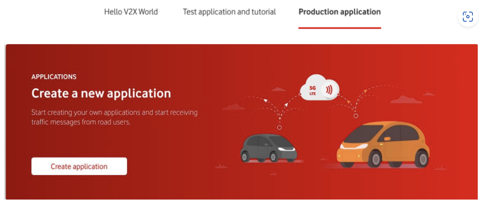

* Choose the Safety V2X product in the product tab.

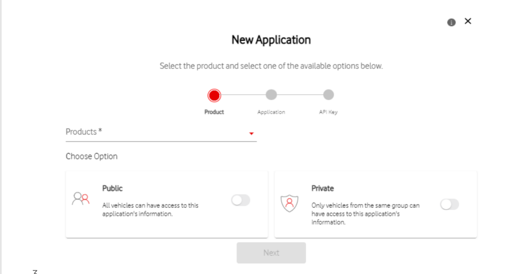
* Choose "API" or "API"+"SDK" component in the Application tab.

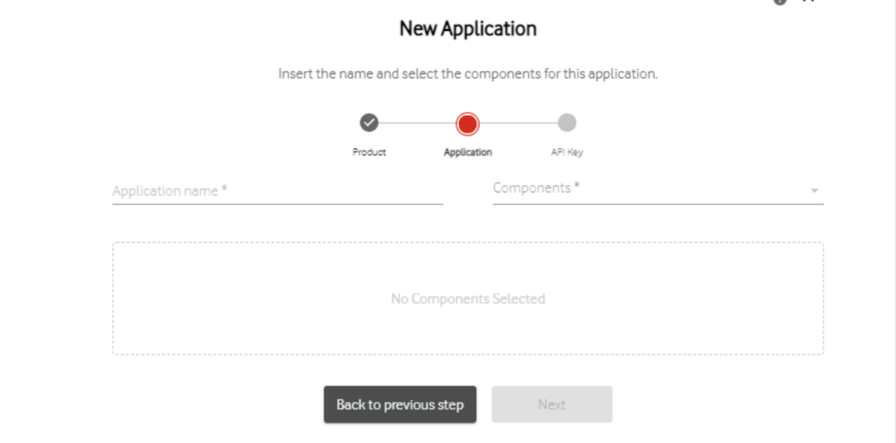

* Provide your specific REST service end-point URL to consume the messages sent by STEP. 

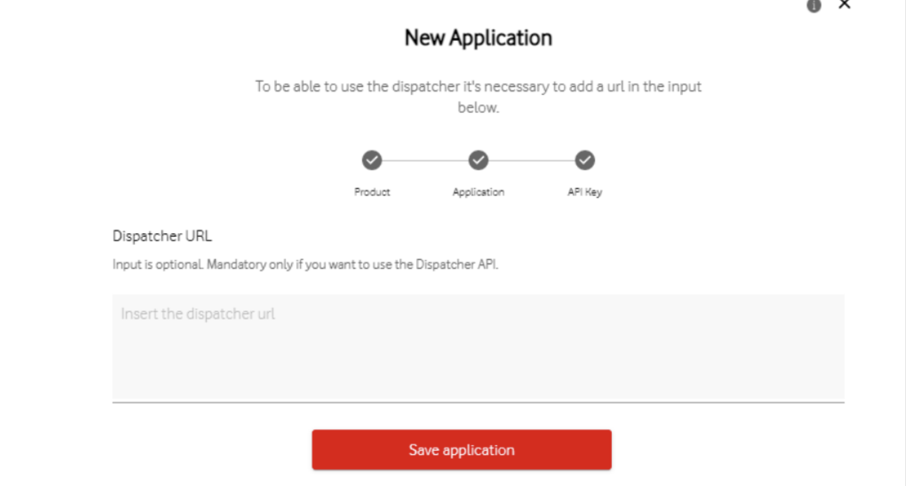

For detailed steps to create new API application, follow Vodafone STEP Portal onboarding steps and successfully conclude an initial registration, subscribing to the desired message categories and get API access using the provided API key [here](https://de-he.step.vodafone.com/portal/products/onboarding/SAFETY-V2X).

4- Application will be created with pending status until it gets approved by STEP, and you will receive an email with your API key.

## Prerequisits

1. Customer Registered to STEP [here](https://de-he.step.vodafone.com/).

2. Customer Logged to STEP [here](https://de-he.step.vodafone.com).

3. Safety V2X API application is created following the steps in the [onboarding documentation](https://de-he.step.vodafone.com/portal/products/onboarding/SAFETY-V2X).

4. Application is approved by STEP and API key is provided.

5. Customer supplied a specific REST service end-point URL to the STEP 
Portal in the dispatcher URL input field, for the system to be able to communicate back (push) the ETSI messages to the 
Customer Systems. 


# Technology


* Java
* SpringBoot
* OpenApi specification
 
Note: The openApi specification allows you to automatically generate the server projects in different programming languages.


## To Generate The Code Based On OpenAPI Specification Using Maven Plugin.

* Clone this repository.
 
* Start your server as a simple SpringBoot java application.

* Add the openAPI specification provided by STEP to src/main/resources directory with the name openapi.yaml


* Generate the jave classes using maven plugin, add the following plugin to the build section of the pom file, and set the path to the `openapi.yaml` in the ``<inputSpec>`` property.

````
<plugin>
				<groupId>org.openapitools</groupId>
				<artifactId>openapi-generator-maven-plugin</artifactId>
				<version>5.3.0</version>
				<executions>
					<execution>
						<goals>
							<goal>generate</goal>
						</goals>
						<configuration>
							<inputSpec>
								${project.basedir}/src/main/resources/openapi.yaml
							</inputSpec>
							<output>${project.basedir}</output>
							<generatorName>spring</generatorName>
							<apiPackage>${project.groupId}.api</apiPackage>
							<modelPackage>${project.groupId}.model</modelPackage>
							<supportingFilesToGenerate>
								ApiUtil.java
							</supportingFilesToGenerate>
							<configOptions>
								<delegatePattern>true</delegatePattern>
							</configOptions>
						</configuration>
					</execution>
				</executions>
			</plugin>
````

then 

````
mvn clean install

````

To Test:

```
IVIM sample reuqest:

POST /v1/v2x HTTP/1.1
Host: localhost:8080
Content-Type: application/json
Content-Length: 1869

{
    "service": "v2x",
    "subService": "IVIM",
    "subServiceGroup": "public",
    "buffer": [
        {
            "geocoding": {
                "type": "g8",
                "subtopics": "s/p/u/b/m/s/j/f"
            },
            "geoaddress": {
                "lat": "43.6640935",
                "lon": "6.9321627"
            },
            "timestamp": "1632838789",
            "payload": "{\"ivim\":{\"header\":{\"protocolVersion\":2,\"messageID\":6,\"stationID\":156255831},\"ivi\":{\"mandatory\":{\"serviceProviderId\":{\"countryCode\":\"5CC0\",\"providerIdentifier\":0}\"iviIdentificationNumber\":1,\"timeStamp\":574821169332,\"validFrom\":574821169335,\"validTo\":574905605000,\"iviStatus\":0},optional\":[{\"glc\":{\"referencePosition\":{\"latitude\":412338676,\"longitude\":-86204710,\"positionConfidenceEllipse\":{\"semiMajorConfidence\":4095,\"semiMinorConfidence\":4095,\"semiMajorOrientation\":3601},\"altitude\":{\"altitudeValue\":1000,\"altitudeConfidence\":\"unavailable\"}},\"referencePositionHeading\":{\"headingValue\":1,\"headingConfidence\":127},\"referencePositionSpeed\":{\"speedValue\":90,\"speedConfidence\":127},\"parts\":[{\"zoneId\":1,\"zoneHeading\":2437,\"zone\":{\"segment\":{\"line\":{\"deltaPositions\":[{\"deltaLatitude\":0,\"deltaLongitude\":0},{\"deltaLatitude\":-340,\"deltaLongitude\":-1121}]}}}}]}},{\"giv\":[{\"detectionZoneIds\":[4,5],\"relevanceZoneIds\":[1,2,3],\"direction\":3,\"applicableLanes\":[2,3,4],\"iviType\":0,\"roadSignCodes\":[{\"code\":{\"iso14823\":{\"pictogramCode\":{\"countryCode\":\"7406\",\"serviceCategoryCode\":{\"trafficSignPictogram\":\"informative\"},\"pictogramCategoryCode\":{\"nature\":9,\"serialNumber\":53}}}}}]}]}]}}}"
        }
    ],
    "stream": {
        "partition": 1,
        "offset": 123456789,
        "messageCount": 1
    },
    "version": "1"
}

```


# Additional Information
## STEP Dispatcher API
Find detailed information about STEP Dispatcher API [here](https://de-he.step.vodafone.com/portal/products/api/dispatcher/SAFETY-V2X).
## Development
Using the provided OpenApi specification supplied by STEP, you can generate the server projects using one of the following approaches:

##### 1. Using OpenApi Generator tool
* Install npm
* In command Line:
     * npm install @openapitools/openapi-generator-cli -g
     * openapi-generator-cli version-manager set 5.3.0
     * npm install @openapitools/openapi-generator-cli -D 

* Generate project:
      * npx @openapitools/openapi-generator-cli generate -i OpenApi.yaml -g spring -o /Desktop/openAPi/v2x

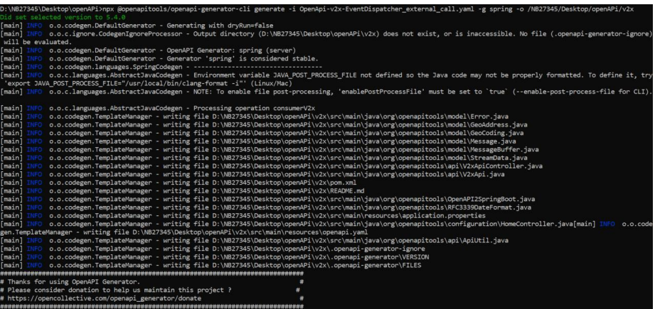

* Generated Project structure

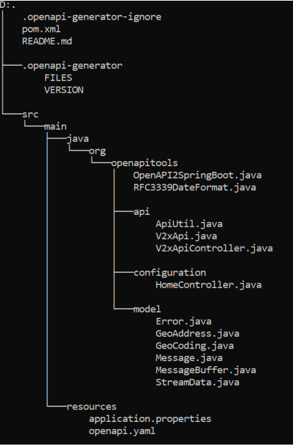

##### 2. Swagger Editor online tool

* Click on Generate Server

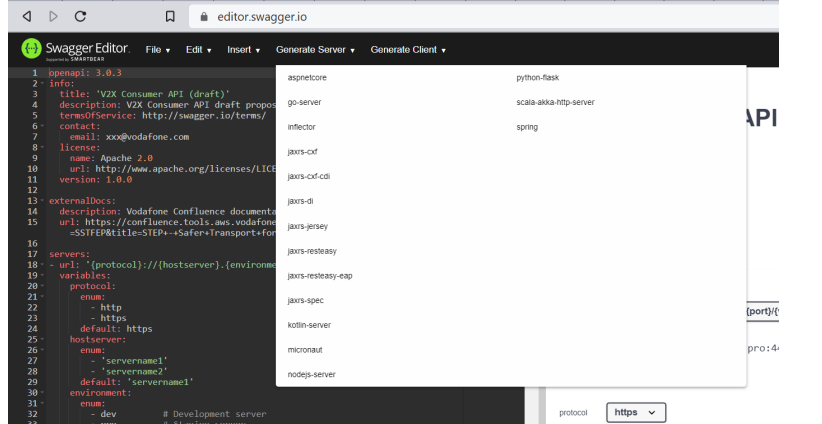

* Choose Spring (for Spring Boot) or any other Java implementation framework (e.g Jaxrs-*)

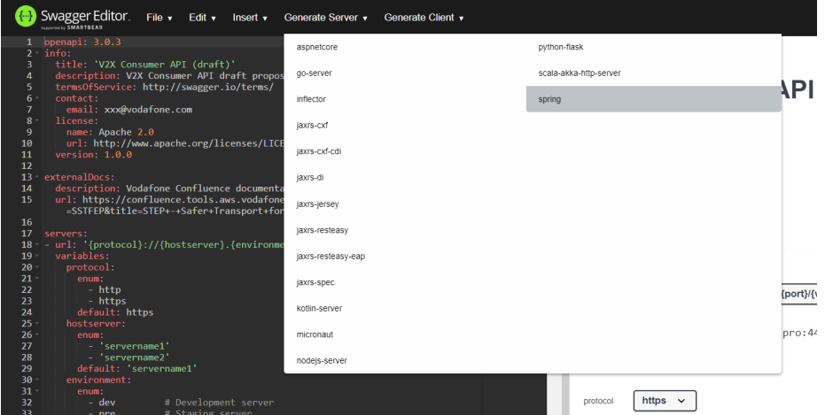

* Download the source code (.zip file) and import it into your IDE of choice.
* Inside the zip you can find the following structure:

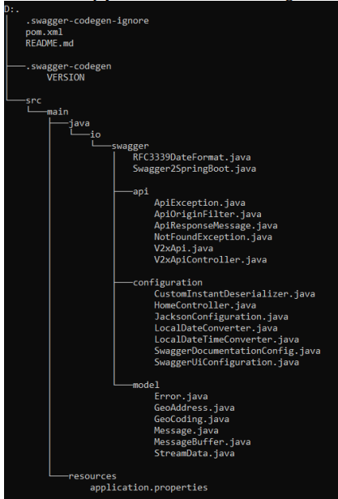


##### 3. Using integrated build tool plugins
###### 3.1 Using Maven 

* To generate the .java files using the maven plugin you need to add in your pom file, the following 
plugin configuration as shown below.

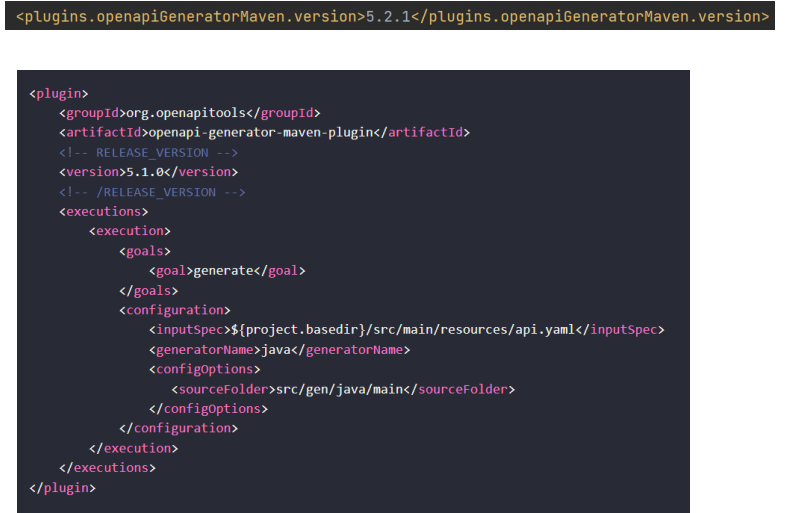

* Afterwards, to generate the Java classes, you will need to run:
   
   mvn clean compile
   

###### 3.2. Using Gradle
* To use Gradle instead of maven, you will need to include the following configuration:

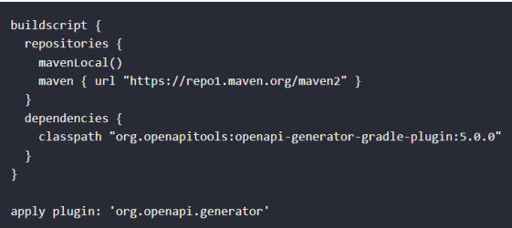 
